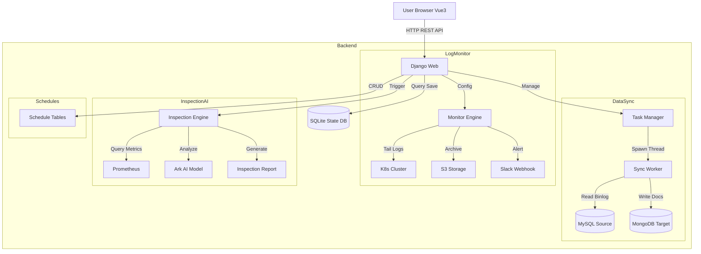

# Shark Platform

[](https://www.python.org/)
[](https://www.djangoproject.com/)
[](https://vuejs.org/)
[](https://element-plus.org/)
[](https://www.docker.com/)

**Shark Platform** 是一个现代化的综合运维管理平台，集成了 **MySQL → MongoDB 数据同步**、**K8s 日志监控告警**、**系统巡检**、**服务部署** 以及 **排班管理** 等核心能力。

平台采用前后端分离架构（Django REST Framework + Vue 3），提供直观的可视化控制台，旨在简化复杂的运维任务与数据管道管理。

---

## ✨ 核心功能

### 1. 🔄 数据同步 (Data Sync)
提供高性能、高可靠的 MySQL 到 MongoDB 实时同步解决方案。
*   **全量 + 增量同步**：自动执行存量数据全量搬运，随后无缝切换至基于 Binlog (CDC) 的增量实时同步。
*   **多种同步模式**：
    *   **History Retention (Append)**：保留数据变更历史。Update/Delete 操作转换为 Insert 操作，生成新版本或 Tombstone 记录，适用于审计与时光机查询。
    *   **Mirror Mode (In-Place)**：目标端与源端保持完全一致。Update 执行覆盖，Delete 执行物理删除（或软删除）。
*   **智能主键探测**：自动识别 MySQL 表的真实主键（支持非 `id` 字段），解决全量同步时的排序分页问题。
*   **断点续传**：记录 Binlog 位点，任务重启后自动从断点继续同步，不丢数据。
*   **自动 Schema 漂移处理**：支持自动发现新表，自动处理新增列。
*   **自定义起始点位**：支持指定 Binlog 文件名和 Position 开始同步。

### 2. 🛡️ 日志监控 (Log Monitor)
基于 Kubernetes 环境的轻量级日志监控方案。
*   **实时日志流**：直接从 K8s API 获取 Pod 日志。
*   **高级告警策略**：
    *   **Threshold Alert**：阈值告警（如：60秒内出现5次 Error）。
    *   **Immediate Alert**：关键词立即告警（如：Panic, Fatal）。
    *   **Ignore/Record**：支持忽略特定日志或仅记录不告警。
    *   **告警抑制**：支持配置静默期（Silence Period），避免重复告警风暴。
*   **错误上下文捕获**：自动提取 Error 日志的前后文（各5行），并独立存储为 `_error.log` 文件，便于快速排查。
*   **日志检索与排序**：支持文件名模糊搜索、按大小/时间排序、批量文件内容搜索。
*   **日志归档**：支持将监控到的日志自动归档至 S3 兼容存储。

### 3. 🔍 系统巡检 (Inspection)
智能化的系统健康度分析与报告生成。
*   **动态评分系统**：基于 CPU/内存/磁盘使用率、Down Targets、Firing Alerts 等指标动态计算系统健康分（0-100）。
*   **AI 趋势预测**：基于历史巡检报告，预测未来 7天/15天/30天 的健康趋势。
*   **周期性报告**：自动生成周报、月报，聚合分析常见故障点。
*   **指标采集**：集成 Prometheus API，自动采集关键指标。

### 4. 📅 排班管理 (Schedules)
灵活的人员排班与轮值管理。
*   **日历视图**：直观展示每日排班情况，支持早/中/晚班颜色区分。
*   **多人员支持**：单班次支持多名值班人员。
*   **API 集成**：提供标准 API 供外部系统（如告警系统）查询当前值班人员。

### 5. 🚀 服务器部署 (Server Deploy)
轻量级的主机管理与批量执行工具。
*   **资产管理**：管理服务器清单（Host, User, Key）。
*   **批量执行**：支持向多台服务器批量分发文件、执行 Shell 脚本。
*   **实时反馈**：Web 端实时展示执行日志与结果状态。

---

## 🏗 系统架构



---

## 🚀 快速开始

### 方式一：Docker Compose 部署（推荐）

最简单的方式是使用 Docker Compose 一键启动所有服务。

1.  **启动服务**
    ```bash
    docker-compose up -d --build
    ```

2.  **访问应用**
    打开浏览器访问：[http://localhost:8000/](http://localhost:8000/)
    *   **默认账号**：`admin`
    *   **默认密码**：`admin` (首次启动自动创建)

### 方式二：本地开发运行

1.  **环境准备**
    *   Python 3.9+
    *   Node.js 16+ (前端构建)
    *   MySQL 5.7+ (开启 Binlog ROW 模式)
    *   MongoDB 4.4+

2.  **后端启动**
    ```bash
    pip install -r requirements.txt
    python manage.py migrate
    python manage.py createsuperuser
    python manage.py runserver 0.0.0.0:8000
    ```

3.  **前端启动**
    ```bash
    cd frontend
    npm install
    npm run dev
    ```

---

## 📂 项目结构

```text
mysql_to_mongo/
├── api/                     # 基础 API 模块
├── core/                    # 核心组件 (Logging, Utils)
├── deploy/                  # [Server Deploy] 部署模块
├── frontend/                # [Frontend] Vue 3 前端源码
├── inspection/              # [Inspection] 巡检模块
├── monitor/                 # [Log Monitor] 监控模块
├── schedules/               # [Schedules] 排班模块
├── shark_platform/          # Django 项目配置
├── tasks/                   # [Data Sync] 同步引擎
├── state/                   # 运行时状态存储
├── logs/                    # 应用运行日志
└── manage.py                # Django 管理入口
```

---

## 📝 最近更新 (Changelog)

*   **Optimization**: 全面优化前端 UI，采用全新的 Sidebar 设计与全局配色。
*   **Optimization**: 优化日志监控后端逻辑，支持大文件流式读取与分页，降低内存占用。
*   **Feature**: 日志监控新增「错误上下文捕获」，自动生成 `_error.log`。
*   **Feature**: 日志监控新增「高级告警策略」，支持阈值、去重、静默期配置。
*   **Feature**: 系统巡检新增「动态评分」与「AI 趋势预测」。
*   **Feature**: 新增排班管理 (Schedules) 模块。
*   **Refactor**: 移除过时的 Django Template 目录，全面转向前后端分离。

---

## 📄 许可证

本项目仅供学习与研究使用。
