<!-- 版本号与 VERSION 文件保持同步，发布前请同步更新 -->
<p align="center">
  
</p>

# 🦈 Shark Platform

<p align="center">
  <strong>综合运维与数据同步平台</strong><br/>
  <sub>Django REST · Vue 3 · MySQL Binlog CDC · K8s 可观测</sub>
</p>

<p align="center">
  
  
  
  
  
  
  
  
  
  
  
</p>

| 项目 | 说明 |
|------|------|
| **当前版本** | `1.2.0`（[VERSION](./VERSION) 与 [frontend/package.json](./frontend/package.json) 的 `version` 字段建议保持一致；README 顶部徽章同步修改） |
| **代码名** | Shark Platform |
| **默认 Web 端口** | 容器内 Nginx **8000** → Gunicorn **8001**（见 [entrypoint.sh](./entrypoint.sh)） |
| **默认数据库** | SQLite：`state/db.sqlite3`（可改为 PostgreSQL/MySQL 等，需自行迁移 settings） |

综合运维管理平台（**Django REST Framework + Vue 3**），单进程内多线程同步任务（Gunicorn **workers=1**），包含：

| 模块 | 说明 | 主要入口 |
|------|------|----------|
| **数据同步** | MySQL → MongoDB（全量 + Binlog ROW 增量） | Web：`/tasks`；API：`/api/tasks/*` |
| **连接与元数据** | 保存 MySQL/Mongo 连接；按连接拉库/表 | `/api/connections/*`、`/api/mysql/*` |
| **日志监控** | K8s Pod 日志扫描、Slack 告警 | `/api/monitor/*` |
| **巡检** | Prometheus 拉取、报表 | `/api/inspection/*` |
| **排班** | 值班表、电话告警回调 | `/api/schedules/*` |
| **AIOps** | Alertmanager webhook、分析展示 | `/api/ai_ops/*` |
| **部署** | 服务器批量执行/计划 | `/api/deploy/*` |
| **数据库管理** | 多数据源查询/结构（独立子应用） | `/api/db/*` |
| **平台账号** | 登录、用户/角色/权限 | `/api/auth/*`、`/api/users`、`/api/roles`、`/api/me` |
| **Traffic** | Nginx 日志聚合、GeoIP、Blackbox、流量大盘 | Web：`/dashboard`；API：`/api/traffic/*`；手册：[docs/TRAFFIC_DASHBOARD.md](./docs/TRAFFIC_DASHBOARD.md) |
| **Django Admin** | 后台管理（需超级用户） | `/admin/` |

生产部署与 RBAC、PVC、Ingress、初始化等请以 **[docs/K8S_RBAC_GUIDE.md](./docs/K8S_RBAC_GUIDE.md)** 为准；**Compose / K8s 示例**见 **[infra/README.md](./infra/README.md)**（与 Django 应用 `deploy/` 无关）。本文侧重**功能总览、API 索引、同步任务配置与常见运维**。

---

## 目录

- [版本与依赖矩阵](#版本与依赖矩阵)
- [系统架构](#系统架构)
- [架构与访问方式](#架构与访问方式)
- [快速开始](#快速开始)
- [配置清单](#配置清单)
- [数据同步（MySQL → MongoDB）](#数据同步mysql--mongodb)
- [REST API 索引](#rest-api-索引)
- [常用运维](#常用运维)
- [常见问题](#常见问题)
- [项目结构](#项目结构)
- [相关文档与目录](#相关文档与目录)
- [许可证](#许可证)

---

## 版本与依赖矩阵

以下为 **`requirements.txt` / `frontend/package.json` / 镜像** 中的主要组件（随升级可能变化，以文件为准）。

### 后端（Python）

| 组件 | 版本（锁定或范围） | 用途 |
|------|-------------------|------|
| Python | 3.9+（Dockerfile: `python:3.9-slim`） | 运行时 |
| Django | 4.2.11 | Web 框架 |
| djangorestframework | 3.14.0 | REST API |
| django-cors-headers | 4.3.1 | 跨域 |
| gunicorn | 21.2.0 | WSGI（**workers=1**） |
| pymysql | 1.1.0 | MySQL 客户端 |
| pymongo | 4.6.1 | MongoDB 驱动 |
| mysql-replication | 1.0.12 | Binlog 解析（增量） |
| pydantic | 2.9.2 | 任务配置校验 |
| kubernetes | 34.1.0 | K8s API（日志监控等） |
| cryptography | 41.0.7 | 加解密（如配置密钥） |
| celery / redis / pika 等 | 见 requirements | 异步与扩展能力 |

### 前端（Node）

| 组件 | 版本 | 用途 |
|------|------|------|
| Node（构建） | 18（Dockerfile 多阶段构建） | 构建镜像 |
| Vue | ^3.2 | 界面框架 |
| Vite | ^3.0 | 构建工具 |
| Element Plus | ^2.13 | UI 组件 |
| Pinia | ^3.0 | 状态管理 |
| Vue Router | ^4.6 | 路由 |
| Axios | ^1.13 | HTTP 客户端 |
| ECharts | ^6.0 | 图表 |

### 外部系统（建议版本）

| 系统 | 建议 | 说明 |
|------|------|------|
| MySQL | 5.7 / 8.0+ | 需 ROW binlog |
| MongoDB | 4.4+ | 副本集更利于事务与线上写入 |
| Kubernetes | 兼容 client-go 对应版本 | 日志监控读 Pod 日志 |

### 浏览器（Web 控制台）

- Chrome / Edge / Firefox **最新两个大版本**
- 需支持 **ES6+** 与现代 CSS（与 Vue 3 + Vite 一致）

---

## 系统架构

```mermaid
flowchart TB
  subgraph Client["客户端"]
    Browser["浏览器 Web UI"]
  end

  subgraph Edge["入口层"]
    Nginx["Nginx :8000\n静态 + 反代"]
  end

  subgraph App["应用层（单 Pod / 单 Worker）"]
    Gunicorn["Gunicorn :8001\nworkers=1"]
    API["Django REST\n/api/*"]
    Sync["同步引擎 tasks/sync\n多线程 Worker"]
  end

  subgraph Data["数据与外部"]
    SQLite[("SQLite\nstate/db.sqlite3")]
    MySQL[("MySQL\nBinlog ROW")]
    Mongo[("MongoDB")]
    K8sAPI["Kubernetes API"]
    Slack["Slack / Webhook"]
    Prom["Prometheus"]
  end

  Browser --> Nginx
  Nginx --> Gunicorn
  Gunicorn --> API
  Gunicorn --> Sync
  API --> SQLite
  Sync --> MySQL
  Sync --> Mongo
  API --> K8sAPI
  API --> Slack
  API --> Prom
```



**要点**：

- **API 与页面**：`/api/*` 走 Django；静态与 SPA 由 Nginx 提供（生产常见路径）。
- **同步任务**：内存 `TaskManager` + 线程 Worker，故 **Gunicorn 必须为单 worker**，否则多进程间任务状态不一致。
- **持久化**：任务配置与状态默认在 **SQLite**；日志文件等见 `logs/`（若启用）。

---

## 架构与访问方式

- **容器内**：Gunicorn 监听 `127.0.0.1:8001`，Nginx 对外 `8000`（见 [entrypoint.sh](./entrypoint.sh)）。
- **前端**：构建产物位于 `frontend/dist/`，由 Nginx 提供静态资源；非静态路径回退 `index.html`（SPA）。
- **API**：统一前缀 **`/api/`**（Django `ROOT_URLCONF` 中注册）。
- **Django Admin**：**`/admin/`**（务必带尾部斜杠或确保反向代理同时匹配 `/admin` 与 `/admin/`，见仓库根目录 [nginx.conf](./nginx.conf)）。
- **鉴权**：REST Framework Session/Basic；前端登录后 Cookie 会话。部分接口使用自定义 `HasRolePermission`（按路径与方法校验 `view_*` / `manage_*` 等权限）。

---

## 快速开始

### 方式一：Docker Compose（本地/测试）

在**仓库根目录**执行（MySQL 配置在 `infra/docker/mysql/`，无需再建 `mysql_conf`）：

```bash
docker compose -f infra/docker/docker-compose.yml up -d --build
```

访问 Web：`http://localhost:8000`（默认超级用户 `admin` / `admin`，由 [entrypoint.sh](./entrypoint.sh) 首次创建，**务必修改密码**）。

### 方式二：Kubernetes（生产）

- 按 [docs/K8S_RBAC_GUIDE.md](./docs/K8S_RBAC_GUIDE.md) 执行。
- 示例清单：`infra/kubernetes/`（需自行改 namespace、镜像、密钥等）。
- 健康检查：`GET /api/system/health`（无鉴权）。

### 方式三：本地开发

**后端**

```bash
pip install -r requirements.txt
python manage.py migrate
python manage.py runserver 0.0.0.0:8000
```

默认数据库：**SQLite** `state/db.sqlite3`（见 `shark_platform/settings.py`）。

**前端**

```bash
cd frontend
npm install
npm run dev
```

生产构建：

```bash
cd frontend && npm run build
```

---

## 配置清单

### 环境变量（K8s ConfigMap / Compose）

| 变量 | 说明 |
|------|------|
| `DJANGO_SECRET_KEY` | 生产必须随机强密钥 |
| `DEBUG` | `True` / `False` |
| `ALLOWED_HOSTS` | 逗号分隔 |
| `CSRF_TRUSTED_ORIGINS` | 逗号分隔完整 URL（含协议） |
| `PUBLIC_URL` | 前端公网地址，用于 Slack 等链接 |
| `DEFAULT_MONITOR_NAMESPACE` | 日志监控默认 namespace（可选） |

### Web 上线后建议配置

1. **修改默认 `admin` 密码**。
2. **Schedules → Phone Alert**：External 回调状态、`Oncall Slack Mapping`（姓名 → Slack `Uxxxx`）等。
3. **Log Monitor**：同集群可 in-cluster kubeconfig；多 namespace 可用逗号分隔；需 RBAC 可读 `pods` / `pods/log`。

---

## 数据同步（MySQL → MongoDB）

### 行为概览

- **全量**：按表批量读取 MySQL，写入 Mongo。
- **增量**：`pymysqlreplication` 订阅 Binlog（`WriteRowsEvent` / `UpdateRowsEvent` / `DeleteRowsEvent`）。
- **任务配置**：持久化在数据库表 **`tasks_synctask`** 的 `config`（JSON）字段；运行时位点等在 **`state`** 字段（JSON）。
- **性能**：增量写入经 `FlushBuffer` 聚合后 `bulk_write`；可选 `RateLimiter` 按负载与写延迟限速。

### 同步语义（与 UI 选项对应）

| 配置项 | 含义 |
|--------|------|
| `update_insert_new_doc` | `true`：UPDATE 时插入**版本文档**（`_is_version` 等），不覆盖 base；`false`：按策略更新 base（镜像/覆盖）。 |
| `use_pk_as_mongo_id` | `true`：Mongo `_id` = MySQL 主键；`false`：`_id` 为 ObjectId，业务主键在 `id` 等字段（UPDATE 时按 `pk_field` 定位）。 |
| `insert_only` / `handle_deletes` | 仅插入 / 是否处理删除等 |

### 可选 Binlog 起点

创建任务时可填 `binlog_filename`、`binlog_position`（与 `SyncTaskRequest` 字段一致）；用于从指定位点开始增量（需与业务约定一致）。

### 性能预设（前端）

创建任务与任务列表的 **Performance Config** 中预设：

| 预设 | 用途 |
|------|------|
| **Conservative (safe)** | 较小批次、偏保守限速 |
| **Balanced** | 默认平衡 |
| **High Throughput (fast)** | 较大批次、关闭限速等 |
| **Turbo** | 极致吞吐（大批次、高连接池、长超时等），**注意监控 Mongo 与宿主机负载** |

保存后再次打开弹窗时，会根据已保存参数**自动推断**当前预设（避免下拉框总显示默认而实际已是 Turbo）。

### 修改现有任务的性能参数

1. 任务列表 → **Performance Config**（齿轮）。
2. 若任务 **RUNNING**：使用 **Stop → Save → Start**（或先停任务再保存），使新参数生效；`MongoClient` 等在任务启动时按配置创建。

可调字段包括但不限于（与后端 `task_config` 白名单一致）：  
`mysql_fetch_batch`、`mongo_bulk_batch`、`inc_flush_batch`、`inc_flush_interval_sec`、`state_save_interval_sec`、`prefetch_queue_size`、`progress_interval`、`rate_limit_enabled`、`max_load_avg_ratio`、`min_sleep_ms`、`max_sleep_ms`、`mongo_max_pool_size`、`mongo_write_w`、`mongo_write_j`、`mongo_socket_timeout_ms`、`mongo_connect_timeout_ms`、`mongo_compressors`、`inc_reconnect_max_retry`、`inc_reconnect_backoff_base_sec`、`inc_reconnect_backoff_max_sec`。

### Turbo Pod 执行模式（新）

可在任务配置中开启 **Turbo Pod**，使该任务不在主应用进程内运行，而是创建一个独立临时 Pod 执行：

- `turbo_enabled`: 是否启用 Turbo Pod
- `turbo_no_limit`: 不限制资源（true 时不设置 requests/limits）
- `turbo_pod_namespace`: 目标 namespace（留空按默认推断）
- `turbo_cpu_request` / `turbo_mem_request`
- `turbo_cpu_limit` / `turbo_mem_limit`

运行行为：

- 启动任务时创建（或重建）`sync-turbo-<task_id>` Pod
- Pod 内执行：`python manage.py run_sync_task --task-id <task_id>`
- 停止任务时删除该 Pod（临时 Pod 模式）

相关环境变量（部署时可选）：

- `SYNC_RUNNER_IMAGE`: Turbo Pod 使用的镜像（默认 `shark-platform:latest`）
- `SYNC_RUNNER_NAMESPACE`: 默认 namespace（任务未指定时生效）
- `SYNC_RUNNER_SERVICE_ACCOUNT`: Turbo Pod 使用的 SA（可选）
- `SYNC_RUNNER_IMAGE_PULL_POLICY`: 默认 `IfNotPresent`
- `SYNC_RUNNER_STATE_PVC`: Turbo Pod 挂载的 state PVC（默认 `shark-platform-state-pvc`）

### MySQL 要求

- `binlog_format=ROW`，建议 `binlog_row_image=FULL`（便于 UPDATE 列映射）。

---

## REST API 索引

前缀均为 **`/api`**（浏览器或 curl 时拼在主机后）。

### 认证与用户

| 方法 | 路径 | 说明 |
|------|------|------|
| POST | `/api/auth/login` | 登录 |
| POST | `/api/auth/logout` | 登出 |
| GET | `/api/me` | 当前用户与权限 |
| GET/POST | `/api/users` | 用户列表/创建 |
| PUT/DELETE | `/api/users/<id>` | 更新/删除用户 |
| GET/POST | `/api/roles` | 角色与权限 |
| GET | `/api/permissions` | 权限列表 |
| GET | `/api/system/health` | 存活/就绪探针（无鉴权） |
| GET | `/api/system/stats` | 系统概览 |

### 连接与同步任务

| 方法 | 路径 | 说明 |
|------|------|------|
| GET/POST | `/api/connections` | 连接列表/保存 |
| GET/DELETE | `/api/connections/<conn_id>` | 查看/删除 |
| POST | `/api/connections/test` | 测试连接 |
| GET | `/api/tasks/list` | 任务 ID 列表 |
| GET | `/api/tasks/status` | 全部任务状态 |
| GET | `/api/tasks/status/<task_id>` | 单任务状态 |
| POST | `/api/tasks/start` | 原始 JSON 启动（`SyncTaskRequest`） |
| POST | `/api/tasks/start_with_conn_ids` | 推荐：前端用连接 ID 组装配置并启动 |
| POST | `/api/tasks/start_existing/<task_id>` | 按库中配置启动 |
| POST | `/api/tasks/stop/<task_id>` | 停止 |
| POST | `/api/tasks/stop_soft/<task_id>` | 软停止 |
| POST | `/api/tasks/delete/<task_id>` | 删除任务 |
| POST | `/api/tasks/reset_and_start/<task_id>` | 清空 state 并重启 |
| GET | `/api/tasks/logs/<task_id>` | 任务日志分页 |
| GET/POST | `/api/tasks/config/<task_id>` | 读取/更新性能子集（POST body: `{ "perf": { ... } }`） |
| POST | `/api/mysql/databases` 等 | 库表元数据 |

### 全局日志与 K8s

| 方法 | 路径 | 说明 |
|------|------|------|
| GET | `/api/logs/files` | 日志文件列表 |
| GET | `/api/logs/download/<filename>` | 下载 |
| GET | `/api/logs/stats` | 统计 |
| GET | `/api/logs/search` | 搜索 |
| GET | `/api/k8s/namespaces` | 命名空间 |
| GET | `/api/k8s/pods` | Pod 列表 |
| GET | `/api/k8s/logs` | Pod 日志 |

### 其它模块（节选）

| 前缀 | 说明 |
|------|------|
| `/api/monitor/` | 日志监控引擎配置与任务 |
| `/api/inspection/` | 巡检配置、运行、报表 |
| `/api/schedules/` | 排班与告警 |
| `/api/ai_ops/` | AIOps |
| `/api/deploy/` | 部署计划与执行 |
| `/api/db/` | 数据库管理（连接、结构、查询） |
| `/api/traffic/` | Traffic Dashboard 数据源（overview、timeseries、geo、top、blackbox） |

完整路由见各应用 `urls.py` 与 [shark_platform/urls.py](./shark_platform/urls.py)。

---

## 常用运维

### 查看应用日志（K8s 示例）

```bash
kubectl logs -f -n <namespace> deploy/shark-platform
```

### 清理历史重复排班（幂等）

```bash
kubectl exec -n <namespace> deploy/shark-platform -- python3 manage.py dedup_schedules
kubectl exec -n <namespace> deploy/shark-platform -- python3 manage.py dedup_schedules --apply
```

可选日期范围：

```bash
kubectl exec -n <namespace> deploy/shark-platform -- \
  python3 manage.py dedup_schedules --from-date 2026-02-01 --to-date 2026-02-10 --apply
```

---

## 常见问题

- **排班重复**：已修复为幂等写入；历史数据用 `dedup_schedules --apply` 清理。
- **Slack 未 @ 到人**：需配置 `Oncall Slack Mapping`（姓名 → `Uxxxx`）。
- **Django Admin 打不开或空白**：  
  - 访问 **`/admin/`**（带斜杠）；  
  - 若前有 Nginx，需将 `/api`、`/admin` 反代到 Django（参考 [nginx.conf](./nginx.conf)）。
- **同步任务性能修改不生效**：须**停止任务后保存**或 **Stop → Save → Start**；运行中实例不会热替换 `MongoClient` 等。
- **Gunicorn workers**：必须 **1 个 worker**（内存任务管理器），见 [entrypoint.sh](./entrypoint.sh) 注释。

---

## 项目结构

```text
mysql_to_mongo/
├── ai_ops/                  # AIOps
├── api/                     # 登录、用户、角色、系统统计、health
├── core/                    # 通用工具
├── traffic/                 # Traffic Dashboard 后端（日志解析、聚合 API）
├── deploy/                  # Django：服务器批量部署引擎（API / 任务执行）
├── infra/                   # Docker Compose + K8s 示例清单（非 Python 包）
│   ├── docker/              # 本地编排、MySQL 配置
│   └── kubernetes/          # Deployment / Service / PVC / ConfigMap
├── docs/                    # K8s 手册、Traffic 手册、排班 API 等
├── inspection/              # 巡检
├── monitor/                 # K8s 日志监控
├── schedules/               # 排班 + 电话告警
├── tasks/                   # MySQL → Mongo 同步引擎 + API
│   └── sync/
├── db_manager/              # 数据库管理 API
├── frontend/                # Vue 3（Vite）
├── logs/                    # 运行日志目录（compose 可挂载，仅 .gitkeep 入库）
├── nginx.conf               # 容器内 Nginx
├── state/                   # SQLite 等（db.sqlite3 默认忽略，保留 .gitkeep）
├── Dockerfile
├── entrypoint.sh
├── manage.py
└── shark_platform/          # Django 项目配置
```

---

## 相关文档与目录

| 文档 / 路径 | 内容 |
|-------------|------|
| [VERSION](./VERSION) | 发布版本号（与 README 徽章、`frontend/package.json` 建议一致） |
| [docs/README.md](./docs/README.md) | 文档索引 |
| [docs/K8S_RBAC_GUIDE.md](./docs/K8S_RBAC_GUIDE.md) | 生产 K8s：RBAC、PVC、Ingress、初始化 |
| [docs/TRAFFIC_DASHBOARD.md](./docs/TRAFFIC_DASHBOARD.md) | Traffic Dashboard 配置手册 |
| [infra/README.md](./infra/README.md) | Docker Compose / Kubernetes 示例说明 |
| [infra/docker/docker-compose.yml](./infra/docker/docker-compose.yml) | 本地多服务编排 |
| [Dockerfile](./Dockerfile) | 多阶段构建镜像 |
| [entrypoint.sh](./entrypoint.sh) | 迁移、默认 admin、Gunicorn + Nginx |
| [nginx.conf](./nginx.conf) | `/api`、`/admin`、SPA |
| [requirements.txt](./requirements.txt) | Python 依赖 |
| [frontend/package.json](./frontend/package.json) | 前端依赖与脚本 |
| [.dockerignore](./.dockerignore) | 镜像构建上下文排除项 |

---

## 许可证

本项目仅供学习与研究使用。
