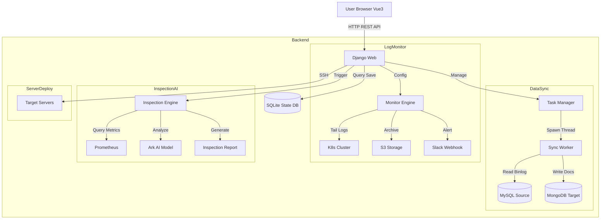

# Shark Platform

[](https://www.python.org/)
[](https://www.djangoproject.com/)
[](https://vuejs.org/)
[](https://element-plus.org/)
[](https://www.docker.com/)

**Shark Platform** 是瞎写的运维平台，主打一个想到啥写啥，练手使用不试用生产环境，现在主要功能 **MySQL → MongoDB 数据同步**、**K8s 日志监控告警**、**系统巡检** 与 **服务部署** 四大核心能力。

平台采用前后端分离架构（Django + Vue 3），提供直观的可视化控制台，旨在简化复杂的运维任务与数据管道管理。

---

## ✨ 核心功能

### 1. 🔄 数据同步 (Data Sync)
提供高性能、高可靠的 MySQL 到 MongoDB 实时同步解决方案。
*   **全量 + 增量同步**：自动执行存量数据全量搬运，随后无缝切换至基于 Binlog (CDC) 的增量实时同步。
*   **多种同步模式**：
    *   **History Retention (Append)**：保留数据变更历史。Update/Delete 操作转换为 Insert 操作，生成新版本或 Tombstone 记录，适用于审计与时光机查询。
    *   **Mirror Mode (In-Place)**：目标端与源端保持完全一致。Update 执行覆盖，Delete 执行物理删除（或软删除）。
*   **智能主键探测**：自动识别 MySQL 表的真实主键（支持非 `id` 字段），解决全量同步时的排序分页问题。
*   **断点续传**：记录 Binlog 位点，任务重启后自动从断点继续同步，不丢数据。
*   **自动 Schema 漂移处理**：支持自动发现新表，自动处理新增列。
*   **数据清洗**：支持全量同步前自动清空目标集合（Start Clean），确保数据一致性起点。

### 2. 🛡️ 日志监控 (Log Monitor)
基于 Kubernetes 环境的轻量级日志监控方案。
*   **实时日志流**：直接从 K8s API 获取 Pod 日志。
*   **关键词告警**：支持配置 Include/Exclude 关键词，命中规则即触发告警。
*   **多渠道通知**：内置 Slack Webhook 集成，实时推送告警信息。
*   **日志归档**：支持将监控到的日志自动归档至 S3 兼容存储（如 AWS S3, MinIO）。

### 3. 🔍 系统巡检 (Inspection)
智能化的系统健康度分析与报告生成。
*   **指标采集**：集成 Prometheus API，自动采集 CPU、内存、磁盘、Up/Down 状态、Firing Alerts 等关键指标。
*   **漏洞集成**：(Mock) 集成安全漏洞扫描结果，展示 CVE 风险。
*   **AI 智能分析**：内置集成 **Ark (Doubao)** 大模型，对采集到的指标和日志进行深度分析，自动生成风险评估报告与处置建议。
*   **报告导出**：自动生成日报/周报/月报，支持历史回溯。

### 4. 🚀 服务器部署 (Server Deploy)
轻量级的主机管理与批量执行工具。
*   **资产管理**：管理服务器清单（Host, User, Key）。
*   **批量执行**：支持向多台服务器批量分发文件、执行 Shell 脚本。
*   **实时反馈**：Web 端实时展示执行日志与结果状态。

---

## 🏗 系统架构



---

## 🗺️ 路线图 (Roadmap)

### 🔄 数据同步 (Data Sync)
- [ ] **并行全量同步**: 支持对大表进行分片并行同步，提升全量阶段速度。
- [ ] **数据转换 DSL**: 支持在同步过程中通过简单脚本对字段进行重命名、脱敏或类型转换。
- [ ] **多源支持**: 扩展支持 PostgreSQL、Oracle 作为源端，支持 Kafka 作为目标端。
- [ ] **健康自愈**: 自动识别 Binlog 位点漂移并尝试安全回溯。

### 🛡️ 日志监控 (Log Monitor)
- [ ] **多渠道告警**: 增加钉钉、飞书、邮件等更多告警推送渠道。
- [ ] **日志趋势分析**: 在 UI 中增加日志频率与告警分布的可视化图表。
- [ ] **本地文件监控**: 支持对非 K8s 环境下的本地日志文件进行监控。

### 🔍 系统巡检 (Inspection)
- [ ] **自定义巡检规则**: 允许用户自定义指标阈值与健康评分算法。
- [ ] **定时报告推送**: 支持通过邮件或 Slack 定期自动发送巡检日报/周报。
- [ ] **多模型支持**: 集成更多大模型（如 GPT-4, Claude）提供更精准的风险分析。

### 🚀 服务器部署 (Server Deploy)
- [ ] **部署模板库**: 内置常用软件（Nginx, Redis, Docker）的一键部署模板。
- [ ] **自动回滚**: 部署失败时支持一键回滚至上个稳定版本。
- [ ] **SSH 连接池**: 优化 SSH 连接性能，支持更大规模的服务器批量执行。

### 🛠 平台架构升级 (Platform Upgrade)
- [ ] **前端重构**: 计划将目前庞大的单文件 `index.html` 重构为模块化的 Vue 3 组件架构，彻底解决加载和维护难题。
- [ ] **安全性**: 引入标准的 RBAC 权限管理，支持多租户/多角色使用场景。
- [ ] **全局监控大屏**: 增加全平台状态概览大屏，实时展示核心指标。

---

## 🔌 API 接口文档

### 1. 任务管理 (Tasks)
Base URL: `/tasks`

| Method | Endpoint | Description |
| :--- | :--- | :--- |
| `GET` | `/list` | 获取所有任务 ID 列表 |
| `GET` | `/status` | 获取所有任务的详细状态（Running/Stopped/Error） |
| `GET` | `/status/<task_id>` | 获取指定任务的详细状态 |
| `POST` | `/start` | 创建并启动新任务（全参数配置） |
| `POST` | `/start_with_conn_ids` | 使用保存的连接 ID 创建并启动任务 |
| `POST` | `/start_existing/<task_id>` | 重启已停止的任务（从断点继续） |
| `POST` | `/reset_and_start/<task_id>` | 重置任务状态（清空位点）并重新全量启动 |
| `POST` | `/stop/<task_id>` | 强制停止任务 |
| `POST` | `/stop_soft/<task_id>` | 软停止任务（等待当前批次处理完） |
| `POST` | `/delete/<task_id>` | 删除任务配置与状态 |
| `GET` | `/logs/<task_id>` | 获取任务运行日志 |

### 2. 连接管理 (Connections)
Base URL: `/connections`

| Method | Endpoint | Description |
| :--- | :--- | :--- |
| `GET` | `/` | 获取所有保存的数据库连接 |
| `POST` | `/` | 创建或更新数据库连接 |
| `DELETE` | `/<conn_id>` | 删除数据库连接 |
| `POST` | `/test` | 测试数据库连接连通性 |

### 3. 日志监控 (Monitor)
Base URL: `/monitor`

| Method | Endpoint | Description |
| :--- | :--- | :--- |
| `GET` | `/tasks` | 获取监控任务列表 |
| `POST` | `/tasks` | 创建/更新监控配置（K8s, S3, Slack） |
| `GET` | `/logs` | 获取监控日志文件列表 |
| `GET` | `/logs/download` | 下载特定监控日志文件 |

### 4. 系统巡检 (Inspection)
Base URL: `/inspection`

| Method | Endpoint | Description |
| :--- | :--- | :--- |
| `POST` | `/run` | 触发一次立即巡检 |
| `GET` | `/reports` | 获取历史巡检报告列表 |
| `GET` | `/reports/<report_id>` | 获取特定报告详情（含 AI 分析） |
| `POST` | `/config` | 更新 Prometheus 和 AI 模型配置 |

### 5. 服务器部署 (Deploy)
Base URL: `/deploy`

| Method | Endpoint | Description |
| :--- | :--- | :--- |
| `GET` | `/servers` | 获取服务器资产列表 |
| `POST` | `/run` | 创建部署计划（Deploy Plan） |
| `POST` | `/execute/<plan_id>` | 执行部署计划 |
| `GET` | `/plans/<plan_id>` | 获取部署计划执行状态与日志 |

---

## 🚀 快速开始

### 方式一：Docker Compose 部署（推荐）

最简单的方式是使用 Docker Compose 一键启动所有服务（包括 Django 应用、MySQL 源数据库、MongoDB 集群）。

1.  **启动服务**
    ```bash
    docker-compose up -d --build
    ```

2.  **访问应用**
    打开浏览器访问：[http://localhost:8000/](http://localhost:8000/)
    *   **默认账号**：`admin`
    *   **默认密码**：`admin` (首次启动自动创建)

3.  **停止服务**
    ```bash
    docker-compose down
    ```

### 方式二：本地开发运行

1.  **环境准备**
    *   Python 3.9+
    *   MySQL 5.7+ (必须开启 Binlog ROW 模式)
    *   MongoDB 4.4+ (必须配置为 Replica Set)

2.  **安装依赖**
    ```bash
    pip install -r requirements.txt
    ```

3.  **初始化与启动**
    ```bash
    # 迁移数据库
    python manage.py migrate

    # 创建管理员
    python manage.py createsuperuser

    # 启动开发服务器
    python manage.py runserver 0.0.0.0:8000
    ```

---

## 📂 项目结构

```text
mysql_to_mongo/
├── api/                     # 基础 API 模块
├── core/                    # 核心组件 (Logging, Utils)
├── deploy/                  # [Server Deploy] 部署模块
├── inspection/              # [Inspection] 巡检模块 (Engine, Prometheus, AI)
├── monitor/                 # [Log Monitor] 监控模块 (K8s, S3, Slack)
├── shark_platform/          # Django 项目配置 (WSGI, Settings)
├── tasks/                   # [Data Sync] 任务管理与同步引擎
│   └── sync/                # 同步核心逻辑 (Worker, Binlog Stream, Writer)
├── templates/               # 前端单页应用 (Vue 3 + Element Plus)
├── static/                  # 静态资源
├── state/                   # 运行时状态存储 (SQLite, JSON Reports)
├── logs/                    # 应用运行日志
├── docker-compose.yml       # 容器编排配置
└── manage.py                # Django 管理入口
```

---

## 🛠 配置说明

### MySQL 配置要求 (作为数据源)
为了支持 CDC (Change Data Capture)，MySQL 必须开启 Binary Log 并设置为 ROW 模式：
```ini
[mysqld]
server_id = 1
log_bin = mysql-bin
binlog_format = ROW
binlog_row_image = FULL
```

### MongoDB 配置要求 (作为目标库)
为了支持事务和某些高级特性，建议 MongoDB 配置为 Replica Set 模式。Docker Compose 环境中已自动配置。

---

## 📝 最近更新 (Changelog)

*   **Fixed**: 修复了 Shark Platform Logo 在 UI 中的显示问题（路径错误及背景遮挡），支持透明背景。
*   **Fixed**: 优化了 Dashboard 性能，增加了请求去抖（Debounce）与按需轮询机制，解决了 UI 无响应问题。
*   **Fixed**: 修复了 "New Task" 按钮在 Overview 页面点击后导致页面跳转而非弹出对话框的逻辑错误。
*   **Fixed**: 修复了 Task Management 在多进程 (Gunicorn Workers > 1) 模式下任务状态分裂、无法停止的问题。
*   **Fixed**: 修复了全量同步时因表主键非 `id` 导致的 `Unknown column 'id'` 错误，现已支持自动探测主键。
*   **Fixed**: 修复了同步任务在遇到不可恢复错误（如 Auth Failed）时无限重试（疯狂重启）的问题，增加了 Fatal Error 熔断机制。
*   **Added**: 新增 "Drop Target Collection Before Full Sync" 选项，允许在全量同步前清空目标集合，解决脏数据残留问题。
*   **Fixed**: 修复了前端部分接口调用 404 的问题 (`/tasks/status/<id>`, `/tasks/stop_soft`).

---

## 📄 许可证

本项目仅供学习与研究使用。
