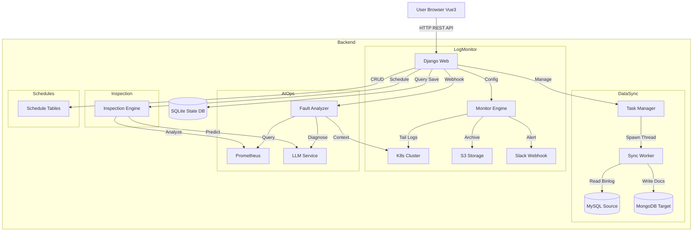

# Shark Platform

[](https://www.python.org/)
[](https://www.djangoproject.com/)
[](https://vuejs.org/)
[](https://element-plus.org/)
[](https://www.docker.com/)

**Shark Platform** 是一个现代化的综合运维管理平台，集成了 **MySQL → MongoDB 数据同步**、**K8s 日志监控告警**、**系统巡检**、**服务部署** 以及 **排班管理** 等核心能力。

平台采用前后端分离架构（Django REST Framework + Vue 3），提供直观的可视化控制台，旨在简化复杂的运维任务与数据管道管理。

---

## ✨ 核心功能

### 1. 🔄 数据同步 (Data Sync)
提供高性能、高可靠的 MySQL 到 MongoDB 实时同步解决方案，支持**全链路自启动**与**断点续传**。
*   **全量 + 增量同步**：自动执行存量数据全量搬运，随后无缝切换至基于 Binlog (CDC) 的增量实时同步。
*   **高可靠性**：
    *   **自动断点续传**：精确记录 Binlog 位点，服务重启后自动恢复同步，确保数据零丢失。
    *   **自启动机制**：任务配置持久化，系统重启后自动拉起所有运行中的任务。
*   **多种同步模式**：
    *   **History Retention (Append)**：保留变更历史，适用于审计与时光机查询。
    *   **Mirror Mode (In-Place)**：目标端与源端保持完全一致（覆盖更新/物理删除）。
*   **智能特性**：
    *   **主键探测**：自动识别非 `id` 主键，解决全量同步排序问题。
    *   **Schema 漂移处理**：自动适应源端表结构变更（新增列/新表）。

### 2. 🛡️ 日志监控 (Log Monitor)
基于 Kubernetes 环境的智能化日志监控方案，支持**多 Namespace** 绑定与**精细化告警**。
*   **灵活采集**：
    *   **多 Namespace 支持**：单个监控任务可同时绑定多个 K8s Namespace（逗号分隔）。
    *   **实时流式处理**：基于 K8s Watch API 实时分析日志流，低延迟、低内存占用。
*   **三级告警策略**：
    1.  **Immediate Alert (立即告警)**：针对 `Panic`, `Fatal` 等严重错误，发现即发送，**不静默**。
    2.  **Threshold Alert (阈值告警)**：针对 `Error`, `Exception` 等常规错误，支持配置阈值（如 60秒内 5次）触发。支持**智能静默**，相同错误 1 小时内仅发送一次。
    3.  **Record Only (仅记录)**：针对已知噪音，仅记录上下文但不发送告警（优先级最高）。
*   **便捷运维**：
    *   **Deep Link 跳转**：Slack 告警消息附带详情链接，一键跳转 Web 控制台查看完整日志（支持自定义域名）。
    *   **错误上下文捕获**：自动截取错误发生前后的日志（各 5 行）独立存储，无需翻阅海量日志。
    *   **日志归档**：支持自动上传至 S3 存储，满足合规留存需求。

### 3. 🤖 智能故障分析 (AI Ops)
基于大语言模型 (LLM) 的故障根因分析与自动化诊断系统。
*   **事件驱动分析**：
    *   接收 Prometheus Alertmanager 告警 Webhook，自动触发分析流程。
    *   支持配置 **AI 分析开关**，灵活选择全自动 AI 诊断或基于规则的快速诊断。
*   **全景上下文收集**：
    *   **指标关联**：根据告警类型（CPU/Memory/IO）自动生成并执行 PromQL 查询，获取故障发生时的指标快照。
    *   **K8s 现场还原**：自动抓取相关 Pod 的状态、Events 事件流以及最近的日志片段。
*   **智能诊断报告**：
    *   调用 LLM (OpenAI/DeepSeek) 生成结构化分析报告，包含：**故障现象**、**根本原因** (定位到具体进程/Pod)、**紧急缓解措施**、**长期预防建议**及**可执行修复命令**。

### 4. 🔍 系统巡检 (Inspection)
全自动化的系统健康度分析引擎。
*   **自动化执行**：内置调度器，每日 **08:00** 自动执行全系统健康检查。
*   **多维评估**：
    *   **动态评分**：基于资源利用率、服务状态、告警数量动态计算健康分 (0-100)。
    *   **趋势预测**：分析历史巡检报告，预测未来 7/15/30 天的健康趋势。
*   **深度报告**：自动生成包含资源热点、异常 Pod、Top 慢查询的详细巡检报告。

### 5. 📅 排班管理 (Schedules)
*   **可视化排班**：日历视图管理每日值班人员，支持早/中/晚多班次。
*   **开放集成**：提供标准 API 供监控系统查询当前 On-Call 人员，实现告警精准路由。

### 6. 🚀 服务器部署 (Server Deploy)
*   **资产管理**：统一管理主机清单与 SSH 密钥。
*   **批量执行**：支持向多台服务器并行分发文件、执行 Shell 脚本，实时回显执行日志。

---

## 🏗 系统架构



---

## 🚀 快速开始

### 方式一：Docker Compose 部署（推荐）

最简单的方式是使用 Docker Compose 一键启动所有服务。

1.  **启动服务**
    ```bash
    docker-compose up -d --build
    ```

2.  **配置环境变量 (可选)**
    在 `docker-compose.yml` 中配置 `PUBLIC_URL` 以启用告警链接跳转功能：
    ```yaml
    environment:
      - PUBLIC_URL=http://your-domain.com
    ```

3.  **访问应用**
    打开浏览器访问：[http://localhost:8000/](http://localhost:8000/)
    *   **默认账号**：`admin`
    *   **默认密码**：`admin` (首次启动自动创建)

### 方式二：Kubernetes 部署

项目提供了标准的 K8s 部署配置文件，位于 `k8s/` 目录下。

1.  **构建并推送镜像**
    ```bash
    docker build -t your-registry/shark-platform:v1 .
    docker push your-registry/shark-platform:v1
    ```

2.  **部署到集群**
    ```bash
    kubectl apply -f k8s/configmap.yaml
    kubectl apply -f k8s/secrets.yaml
    kubectl apply -f k8s/pvc.yaml
    kubectl apply -f k8s/shark-platform.yaml
    ```

3.  **权限配置**
    如果需要监控其他 Namespace，请确保 ServiceAccount 拥有相应的 `view` 权限：
    ```bash
    kubectl create rolebinding monitor-user-view-binding \
      --clusterrole=view \
      --serviceaccount=default:monitor-user \
      --namespace=target-namespace
    ```

### 方式三：本地开发运行

1.  **依赖准备**
    *   Python 3.9+
    *   Node.js 16+
    *   MySQL 5.7+ (开启 Binlog ROW 模式)
    *   MongoDB 4.4+

2.  **后端启动**
    ```bash
    pip install -r requirements.txt
    python manage.py migrate
    python manage.py createsuperuser
    python manage.py runserver 0.0.0.0:8000
    ```

3.  **前端启动**
    ```bash
    cd frontend
    npm install
    npm run dev
    ```

---

## 📂 项目结构

```text
mysql_to_mongo/
├── api/                     # 基础 API 模块
├── core/                    # 核心组件 (Logging, Utils)
├── deploy/                  # [Server Deploy] 部署模块
├── frontend/                # [Frontend] Vue 3 前端源码
├── inspection/              # [Inspection] 巡检模块
├── monitor/                 # [Log Monitor] 监控模块
├── schedules/               # [Schedules] 排班模块
├── shark_platform/          # Django 项目配置
├── tasks/                   # [Data Sync] 同步引擎
├── state/                   # 运行时状态存储
├── logs/                    # 应用运行日志
└── manage.py                # Django 管理入口
```

---

## 📄 许可证

本项目仅供学习与研究使用。
